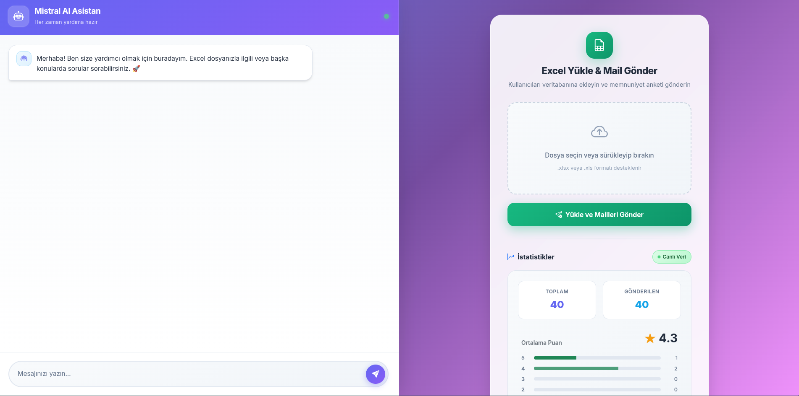

# AI Chatbot & Excel Mailer
<p align="center">
  
  
</p>

🤖 Mistral AI destekli chatbot ve Excel tabanlı memnuniyet anketi sistemi.

[](https://opensource.org/licenses/MIT)
[](https://nodejs.org/)

## 🚀 Özellikler

- 🤖 **Mistral AI Chatbot** - Yapay zeka destekli akıllı sohbet asistanı
- 📊 **Excel Yükleme** - CSV/Excel ile toplu kullanıcı ekleme
- 📧 **Otomatik Email** - 5 yıldızlı memnuniyet anketi gönderimi
- 📈 **İstatistikler** - Gerçek zamanlı puan analizi ve dashboard
- 🔒 **Supabase Entegrasyonu** - Güvenli veritabanı yönetimi

## 📋 Gereksinimler

- Node.js 18+
- Supabase hesabı (veritabanı için)
- Gmail hesabı (email gönderimi için)
- Mistral AI API anahtarı

## 🛠️ Kurulum

### 1. Repoyu klonlayın
```bash
git clone https://github.com/suaybdemir/ai-chatbot-excel.git
cd ai-chatbot-excel
```

### 2. Bağımlılıkları yükleyin
```bash
npm install
```

### 3. Environment değişkenlerini ayarlayın
```bash
cp .env.example .env
# .env dosyasını kendi değerlerinizle düzenleyin
```

### 4. Veritabanını oluşturun
Supabase SQL editöründe `supabase_schema.sql` dosyasını çalıştırın.

### 5. Uygulamayı başlatın
```bash
npm start
# veya geliştirme için
npm run dev
```

Uygulama `http://localhost:7860` adresinde çalışacaktır.

## 🔐 Environment Variables

| Değişken | Açıklama |
|----------|----------|
| `SUPABASE_URL` | Supabase proje URL'i |
| `SUPABASE_ANON_KEY` | Supabase anonymous key |
| `EMAIL_USER` | Gmail adresi |
| `EMAIL_PASS` | Gmail App Password |
| `MISTRAL_API_KEY` | Mistral AI API anahtarı |
| `PORT` | Sunucu portu (varsayılan: 7860) |

## 🐳 Docker ile Çalıştırma

```bash
docker build -t ai-chatbot-excel .
docker run -p 7860:7860 --env-file .env ai-chatbot-excel
```

## ☁️ Deployment

### Hugging Face Spaces
1. Yeni bir Docker Space oluşturun
2. Secrets bölümüne environment değişkenlerini ekleyin
3. Repoyu Space'e bağlayın

### Railway
```bash
railway deploy
```

## 📁 Proje Yapısı

```
├── server.js          # Ana sunucu dosyası
├── index.html         # Frontend arayüzü
├── Dockerfile         # Docker konfigürasyonu
├── package.json       # Node.js bağımlılıkları
├── supabase_schema.sql # Veritabanı şeması
└── KURULUM.md         # Detaylı kurulum rehberi
```

## 📄 Lisans

Bu proje [MIT Lisansı](LICENSE) altında lisanslanmıştır.

## 👨‍💻 Geliştirici

**Suayb Demir**

---

⭐ Bu projeyi beğendiyseniz yıldız vermeyi unutmayın!
